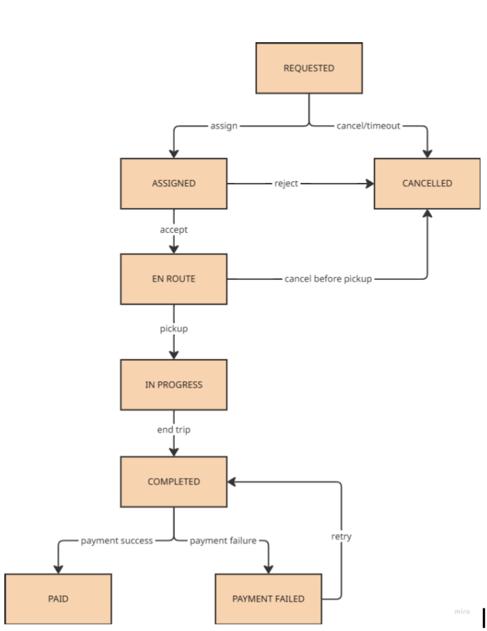

# Student 3 (Hurera) : Trip State Machine & Distributed Transactions ("The Ledger")

> Global Ride-Sharing Platform — Modern Distributed Computing, final design document.

---

## 1. Architectural Design

### 1.1 Trip State Machine



*Figure 1 — Trip lifecycle. Eight states, ten legal transitions. `PAID` and
`CANCELLED` are terminal (immutable).*

A trip is modelled as a **finite state machine**: the set of legal states and the
legal moves between them are fixed, and (as Section 1.3 shows) enforced by the
database itself. An illegal jump — e.g. charging a trip that never completed — is
made *structurally impossible*, rather than something we merely hope application
code avoids.

**The states:**

| State | Meaning |
|---|---|
| `REQUESTED` | Rider asked for a ride; no driver yet |
| `ASSIGNED` | A driver was picked; awaiting their accept |
| `EN_ROUTE` | Driver accepted and is driving to the pickup |
| `IN_PROGRESS` | Rider is in the car; trip underway |
| `COMPLETED` | Trip ended; fare known; not yet settled |
| `PAID` | Payment succeeded — **terminal** |
| `PAYMENT_FAILED` | Charge attempt failed; eligible for bounded retry |
| `CANCELLED` | Trip ended before completion — **terminal** |

**The legal transitions (the only moves allowed):**

| From | To | Trigger |
|---|---|---|
| REQUESTED | ASSIGNED | assign |
| REQUESTED | CANCELLED | cancel / timeout |
| ASSIGNED | EN_ROUTE | accept |
| ASSIGNED | CANCELLED | reject |
| EN_ROUTE | IN_PROGRESS | pickup |
| EN_ROUTE | CANCELLED | cancel before pickup |
| IN_PROGRESS | COMPLETED | end trip |
| COMPLETED | PAID | payment success |
| COMPLETED | PAYMENT_FAILED | payment failure |
| PAYMENT_FAILED | COMPLETED | retry (re-enters settlement) |

Any move not in this table is rejected. A mid-ride abort (trip ended early) is
*not* a separate state: it is the normal `IN_PROGRESS → COMPLETED → settlement`
path with a partial `fare_amount`, which keeps the machine lean.

Three decisions in this state machine carry the distributed-systems argument:

1. **Every transition is an append-only event, not just a field overwrite.** The
   `trips.current_state` column is a convenience cache; the *truth* is the
   `trip_state_transitions` log. This makes the trip fully **auditable** and lets
   recovery rebuild current state by replaying the log — no transition is ever
   silently lost or rewritten.
2. **The state guard is enforced by the database, not the application.** A
   transition is a conditional write —
   `UPDATE … WHERE current_state = :from AND version = :ver`. If two workers race
   (or a network partition produces two would-be writers), only one update
   matches the guard and the other writes zero rows and aborts. The `version`
   acts as a **fencing token**, so a stale/split-brain writer cannot overwrite
   fresh state. This is what makes "a driver is never double-booked" and "no
   illegal skips" hold under concurrency.
3. **Settlement is a bounded loop into immutable terminals.** `PAYMENT_FAILED →
   COMPLETED` allows retry, but `settle_attempts` caps it; `PAID` and `CANCELLED`
   have no outgoing edges. So recovery can never resurrect a settled trip into a
   state where billing and completion contradict each other.

### 1.2 Why Distributed Transactions Are Hard Under Partial Failure

**Partial failure** means some parts of the system succeed while others fail or
become unreachable — *and you cannot tell which*. A request sent with no reply
could mean "it failed" or "it succeeded but the acknowledgement was lost."

*Within* the trip ledger this is a solved problem: CockroachDB gives ACID
guarantees within a region (Raft consensus over a quorum of replicas), so a state
transition either commits on a majority or not at all. The genuinely hard part is
the **one boundary where a single business operation spans two independent
failure domains**: `COMPLETED → PAID` crosses from our regional ledger to an
**external payment provider** over the network.

At that boundary the partial-failure problem bites. We send a charge; the network
drops the response. Did the money move? We cannot know, and every option is bad:
(a) assume failure and retry → risk a **double charge**; (b) assume success →
risk an **unpaid completed trip**; (c) hold a lock and block until we find out →
**unbounded** wait, and if our node also crashes the trip and its lock are stuck.

Crucially, "money moved at the provider" and "trip marked `PAID` in our DB"
**cannot be made one atomic transaction** — the provider is not a participant in
our database and shares none of our commit/rollback machinery. A Two-Phase Commit
across that boundary would force the provider to hold a *prepared* lock awaiting
our coordinator, and a crashed coordinator would block the provider's resources
indefinitely. This is precisely why final settlement is handled as a **Saga with
idempotent retries and compensation, not a global 2PC** — developed in Section 2.
The schema already anticipates it: `UNIQUE(payments.idempotency_key)` makes a
retried charge safe, and `settle_attempts` bounds the loop so a flapping provider
cannot trigger a retry storm.

### 1.3 Database Schema

The Ledger uses **four tables**. `trips` holds the live snapshot of every trip;
`trip_state_transitions` is an append-only history used for audit and crash
recovery; `payments` records every charge attempt; `driver_credits` records the
driver payout. All four are stored in **CockroachDB**, geo-partitioned so each
region's rows are domiciled and consensus-replicated locally.

#### Table 1 — `trips` (live snapshot, one row per trip)

This row is overwritten as the trip advances through the state machine; it always
reflects the *current* state.

| Column | Type | Purpose |
|---|---|---|
| `trip_id` | UUID (PK) | Unique id for the trip |
| `rider_id` | UUID | Who requested the ride |
| `driver_id` | UUID, NULL until ASSIGNED | The assigned driver |
| `current_state` | enum | Current state-machine state |
| `fare_amount` | NUMERIC(12,2) | Set at COMPLETED (full or partial fare) |
| `currency` | CHAR(3) | Currency code, e.g. `USD` |
| `version` | BIGINT | Optimistic-lock / fencing token |
| `settle_attempts` | INT | Bounds the PAYMENT_FAILED retry loop |
| `created_at` / `updated_at` | TIMESTAMPTZ | Timestamps |

#### Table 2 — `trip_state_transitions` (append-only history)

One row per state change, **insert-only** — never updated or deleted. This is the
flight recorder: the audit trail and the source for replay-based recovery.

| Column | Type | Purpose |
|---|---|---|
| `transition_id` | UUID (PK) | Unique id for this transition |
| `trip_id` | UUID (FK → trips) | Which trip |
| `from_state` | enum | State moved from |
| `to_state` | enum | State moved to |
| `event_id` | UUID | Client dedup key |
| `created_at` | TIMESTAMPTZ | When the transition occurred |

**UNIQUE(trip_id, event_id)** — a duplicate client retry cannot re-apply a transition.

#### Table 3 — `payments` (one row per charge attempt)

| Column | Type | Purpose |
|---|---|---|
| `payment_id` | UUID (PK) | Unique id for this attempt |
| `trip_id` | UUID (FK → trips) | Which trip |
| `idempotency_key` | UUID | Prevents double-charging on retry |
| `amount` | NUMERIC | Charge amount |
| `currency` | CHAR(3) | Currency code |
| `status` | enum | PENDING / SUCCEEDED / FAILED |
| `provider_ref` | text | Payment processor's reference |
| `attempt_no` | INT | Which retry this is |
| `created_at` | TIMESTAMPTZ | When |

**UNIQUE(idempotency_key)** — the same payment request can never charge twice.

#### Table 4 — `driver_credits` (driver payout, exactly one per trip)

| Column | Type | Purpose |
|---|---|---|
| `trip_id` | UUID (PK + FK → trips) | Which trip; PK enforces one credit per trip |
| `driver_id` | UUID | Who gets paid |
| `amount` | NUMERIC | Payout amount |
| `created_at` | TIMESTAMPTZ | When |

#### How the tables relate

```
                      trips  (one row per trip — the live state)
                        | trip_id
        +---------------+----------------+
        |               |                |
trip_state_transitions  payments   driver_credits
 (many per trip,        (many per   (exactly one
  append-only log)       trip)       per trip)
```

`trips` is the center; the other three reference it via `trip_id`. Only
`trip_state_transitions` is append-only (a history); the others store one or more
rows per trip as needed.

#### Constraints → invariant mapping

| Constraint | Invariant enforced |
|---|---|
| Append-only `trip_state_transitions` + derived `current_state` | Auditable; replay-based recovery |
| Guarded `UPDATE trips SET current_state=:to WHERE current_state=:from AND version=:ver` | Illegal/skip transitions impossible; fencing stops split-brain |
| `UNIQUE(trip_id, event_id)` | Duplicate client retries don't re-apply a transition |
| `UNIQUE(payments.idempotency_key)` | Duplicate retries never double-charge |
| `driver_credits` PK = `trip_id` | Exactly one credit per trip; billing can't contradict completion |
| Partial unique index `one_active_trip_per_driver` ON `trips(driver_id)` WHERE state IN (ASSIGNED, EN_ROUTE, IN_PROGRESS) | Driver never double-booked (DB-enforced) |
| `settle_attempts` counter | Bounds retry loop → no retry-storm contribution |

---

## 2. Transaction Management

Final settlement spans two systems that do **not** share a database: our trip
ledger (CockroachDB, regional) and an external **Payment Service Provider (PSP)**.
"Mark the trip `PAID`" and "move the money at the PSP" must both happen, or
neither — but they live in different failure domains. There are two classic ways
to coordinate this: **Two-Phase Commit (2PC)** and the **Saga pattern**.

### 2.1 Two-Phase Commit (2PC)

A coordinator runs the operation in two rounds:

1. **Prepare:** the coordinator asks every participant "can you commit?" Each
   participant does the work, locks the resources, and replies *yes* (promising
   it can commit if asked) or *no*.
2. **Commit:** if all said yes, the coordinator tells everyone to commit;
   otherwise everyone aborts.

It gives **strong atomicity**, but at a cost that is fatal at our boundary:

- **Blocking on coordinator failure.** Between *prepare* and *commit*, every
  participant holds locks. If the coordinator crashes after participants voted
  yes, they are stuck holding those locks with no safe way to decide alone.
- **The PSP is not a 2PC participant.** An external payment provider will not
  enter a *prepared* state and hold a lock on our coordinator's behalf. We do not
  control it and cannot make it speak our commit protocol.
- **Latency & availability.** Holding locks across a wide-area, third-party call
  ties trip throughput to the slowest external dependency.

### 2.2 Saga Pattern (chosen)

A Saga breaks the operation into a sequence of **local transactions**, each with
a matching **compensating transaction** that semantically undoes it. There is no
global lock: every step commits independently and immediately. If a later step
fails permanently, the Saga runs the compensations for the steps that already
succeeded — a *semantic rollback* (e.g. a refund), not a database rollback.

Our settlement Saga has three forward steps. The last one is the **pivot** —
once it commits, the Saga has succeeded and compensation no longer applies; the
trip is `PAID`. A failure in any earlier step triggers compensation backwards
and the trip transitions `COMPLETED → PAYMENT_FAILED` for bounded retry or
operator follow-up.

| # | Forward step (Tᵢ) | Compensation (Cᵢ) |
|---|---|---|
| T1 | Charge rider at the PSP (with `idempotency_key`) | C1: Refund rider at the PSP |
| T2 | Write `driver_credits` row | C2: Reverse the driver credit |
| T3 (pivot) | Record `payments` SUCCEEDED + transition `COMPLETED → PAID` | — (pivot; no compensation) |

This ordering deliberately keeps `PAID` truly terminal (as locked in Section
1.1): it is only entered after the money has moved *and* the driver has been
credited, so the state machine never needs an outgoing edge from `PAID`.

Two properties from the Section 1.3 schema make this safe:

- **Idempotent retry (forward recovery).** Every step is keyed —
  `UNIQUE(payments.idempotency_key)` and `driver_credits` PK = `trip_id`. On a
  timeout/unknown result we simply *retry the same step with the same key*; a
  charge that actually landed is not duplicated. Retries are the first line of
  defence; compensation is only the fallback.
- **Bounded loop.** `settle_attempts` caps retries so a flapping PSP cannot
  cause a retry storm; on exhaustion the trip rests in `PAYMENT_FAILED` (a safe,
  non-terminal state) for operator follow-up rather than spinning forever.

### 2.3 Sequence Diagram — Compensating Transactions

The diagram shows the failure case: T1 (charge) succeeds, but T2 (write
`driver_credits`) fails permanently after retries are exhausted. The Saga
compensates backwards (C1 refund) and the trip transitions to `PAYMENT_FAILED`.
Note that the **pivot (T3) is never reached**, so `PAID` is never entered —
preserving its terminal/immutable status from Section 1.1.


*Figure 2 — Saga compensation. T1 succeeds at the PSP; T2 fails permanently
after `settle_attempts` is exhausted; C1 refunds at the PSP and the trip
transitions to `PAYMENT_FAILED`. The pivot (T3) is never reached, so `PAID` is
never entered — preserving its terminal/immutable status from Section 1.1.*

### 2.4 Tradeoff Summary

| | 2PC | Saga (chosen) |
|---|---|---|
| Consistency | Strong / immediate atomicity | Eventual; consistent after compensation |
| Locks | Holds locks across prepare→commit | None held between steps |
| Coordinator crash | Participants block indefinitely | Steps already committed; resume/compensate on recovery |
| External PSP | Cannot participate (no prepared state) | Works — only needs idempotent charge + refund |
| Latency coupling | Throughput tied to slowest participant | Each step commits locally and immediately |
| Failure handling | All-or-nothing rollback | Forward retry first, semantic compensation as fallback |

**Conclusion:** because the PSP cannot join a 2PC and a crashed coordinator would
block resources across a third party, the Ledger uses a **Saga**: idempotent
forward retries for transient faults, bounded by `settle_attempts`, with
compensating transactions for permanent failure. This upholds the invariant that
recovery never leaves billing and trip completion contradicting each other.

---

## 3. Concurrency Control

The trip DB serves two very different readers: the **live transactional path**
(state transitions, settlement) and **analytics engines** running heavy reports
over the same tables. The job of concurrency control is to let both run
correctly without blocking each other.

### 3.1 What MVCC Is (plain language)

**Multiversion Concurrency Control (MVCC)** means a write does not overwrite a
row in place. Instead it creates a **new version** of the row stamped with a
timestamp, and the old version is kept. A reader is given a **snapshot**: a
consistent view of the database as of one timestamp. It simply reads the newest
version that existed at or before that timestamp and ignores anything written
later.

The analogy: instead of one whiteboard that everyone erases and rewrites
(forcing readers and writers to take turns), MVCC is a **stack of dated
photographs**. A writer adds a new photo to the top; a reader is handed one
specific photo and reads it undisturbed, no matter how many new photos are added
while they look.

The consequence — and the answer to "how does MVCC help read performance":
**readers don't block writers and writers don't block readers.** A long analytics
query never has to take read locks on `trips` / `payments`, so it cannot stall a
driver being assigned or a payment being settled — and those writes cannot stall
the report. This pairs naturally with our append-only `trip_state_transitions`
table (Section 1.3), which is already a versioned history by design.

### 3.2 How Analytics Engines Query the Trip DB

A revenue or utilisation report scans millions of rows for seconds or minutes.
If it read *live* data it would either take locks (stalling the money path) or
see the database mutating mid-scan. Instead, analytics runs as a **snapshot read
at a past timestamp** — in CockroachDB, `SELECT … AS OF SYSTEM TIME` (a bounded
staleness / follower read):

| Property | Why it matters here |
|---|---|
| Consistent point-in-time snapshot | The whole report reflects one instant — no half-applied transitions |
| Zero lock contention with writers | Trip assignment & settlement never wait on analytics |
| Can be served by a local **follower** replica | Geo-partitioned: a region's analytics reads stay in-region (low latency, no cross-region traffic) |
| Slightly stale (seconds) | Acceptable for dashboards; the **money path never uses stale reads** |

So the staleness is a deliberate, bounded tradeoff: dashboards tolerate
seconds-old data in exchange for never contending with — or corrupting — the
live trip ledger.

### 3.3 Isolation Level Choice

The transactional path uses CockroachDB's default, **SERIALIZABLE** — the
strongest level — because the Ledger's invariants involve *decisions made on
what was read* (e.g. "only settle if `settle_attempts < N`"; "only assign if the
driver has no active trip"). Weaker levels permit **write skew**, which would
break exactly these invariants. Analytics uses a **read-only consistent
snapshot**, which by construction sees none of the anomalies below.

### 3.4 Anomalies Prevented (concrete examples)

| Anomaly | Without protection (ride-sharing example) | Prevented by |
|---|---|---|
| **Dirty read** | A revenue report sums a `payments` row that is still `PENDING` inside an in-flight Saga (Section 2); the charge later fails and rolls back → report counts money that never moved | Snapshot read (only committed versions are visible) |
| **Non-repeatable / read skew** | A report joins `trips` + `payments` mid-scan while a trip goes `COMPLETED → PAID`; it sees the trip as `PAID` but the payment row still `PENDING` → a report where billing and completion contradict | Single-timestamp snapshot |
| **Phantom** | "Active trips per driver" counts rows, and new `trip_state_transitions` are inserted mid-query → totals that never existed at any instant | Snapshot / SERIALIZABLE |
| **Lost update** | Two settlement workers both read `settle_attempts = 2`, both increment to 3 → one retry is "lost", retry bound is silently exceeded | SERIALIZABLE + guarded `version` write |
| **Write skew** | Two concurrent workers each check "driver has no active trip" (both see none) and each assign a trip → driver double-booked; or two settlement attempts both pass the `settle_attempts < N` check → double charge | SERIALIZABLE (the key reason we don't use a weaker level) |

**Conclusion:** MVCC lets analytics engines read the trip database at full speed
on a consistent snapshot with zero impact on the live money path, while
SERIALIZABLE isolation on that money path prevents the write-skew and
lost-update anomalies that would otherwise let a driver be double-booked or a
trip be double-charged — closing the loop on the section's non-negotiable
invariants.
